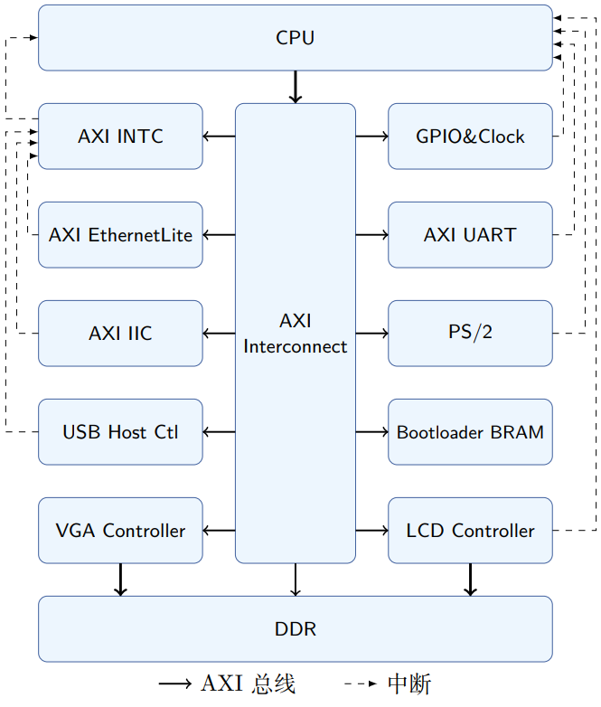

# Mariver SoC

> 我们力求充分使用实验板硬件资源，打造一个完备的计算机系统

## 整体架构



- 支持DDR、串口、以太网、触摸I2C、SD卡、GPIO、PS/2键盘、VGA和LCD等外设
- 其中GPIO、键盘、VGA、LCD的控制器全部由我们**自行实现**
  > 我们还对它们进行了一些面向性能的设计，例如DMA加速

## 文件结构

```
├─ip_repo //使用Vivado打包的各种IP核
│  ├─mariver_cpu //Mariver CPU核
│  ├─general_reg_controller //GPIO、PS/2控制器
│  ├─lcd_controller //LCD控制器
│  ├─lcd_dma_controller //LCD DMA控制器
│  ├─vga_controller //VGA控制器
│  ├─mariver_cpu //Mariver CPU核
│  └─uart16550_wrapper //为AXI UART16550加了一层wrapper
├─mariver_soc //Vivado工程目录
└─src 
    ├─bootloader //编译好的U-Boot COE文件
    ├─constrs //DDR的约束文件
    └─hdl //简单的同步复位、LCD复位模块
```

## 使用方法

使用Vivado打开`mariver_soc/mariver_soc.xpr`即可。

